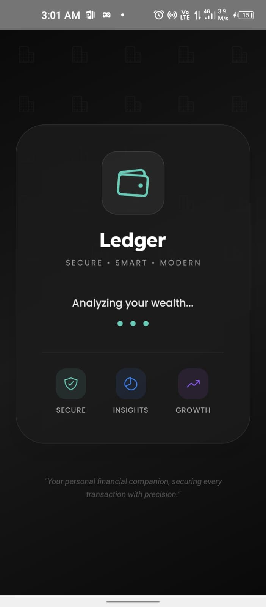
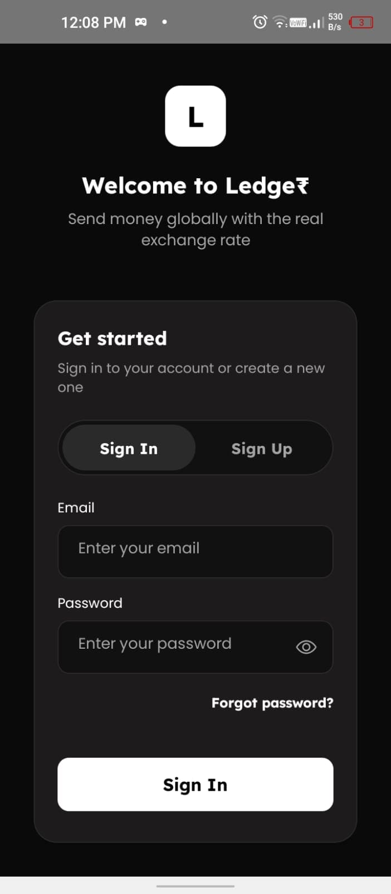
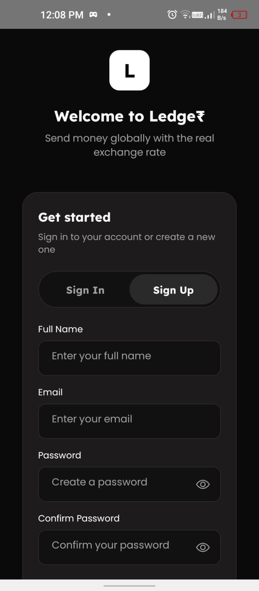
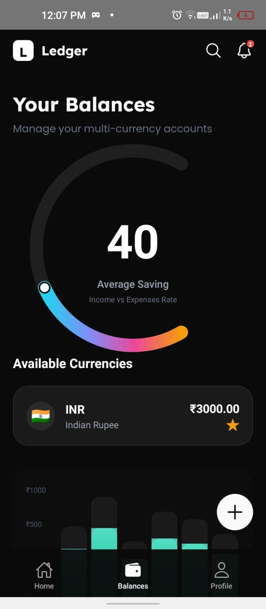
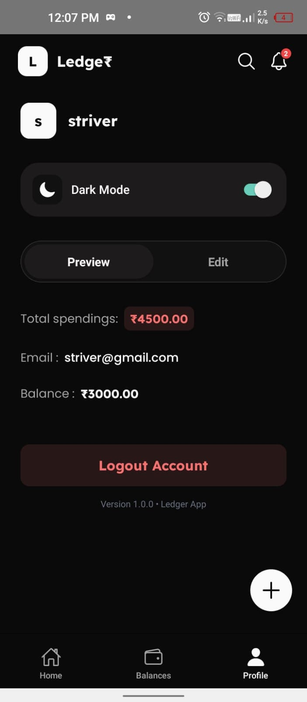
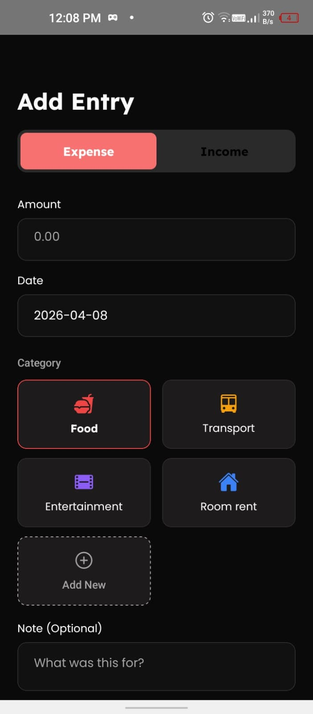

# Ledger - Premium Expense Tracker

Ledger is a premium, fintech-style mobile application built with React Native CLI. It demonstrates high-level system design, scalable architectural patterns, and advanced UI interactions.

# Screenshots

  
  
  
  
  
  
  

# Technical Highlights

1. Custom useForm Architecture : A decoupled validation engine that handles state, touched tracking, and real-time validation without bloating UI components.
2. Advanced Gestures : High-performance UI interactions implemented with react-native-gesture-handler and reanimated for a smooth, native feel.
3. Dynamic Theming Engine : Support for Dark & Light modes with persistent storage using AsyncStorage.
4. SVG Data Visualization : Custom-built Gauge Charts and Gradient Bar Charts utilizing Reanimated Worklets for 60FPS performance.
5. Modern Styling : Styled entirely with NativeWind (Tailwind CSS) for consistent, maintainable design across all components.

# System Architecture

1. State Management : React Context API (ExpenseContext, ThemeContext) for lightweight, efficient global state.
2. Logic Decoupling : Business rules and validation schemas are isolated from the View layer in src/utils/validators.ts.
3. Atomic Component Library : Centralized UI library containing inputs, buttons, and complex cards designed for maximum reusability and scalability.

# Technical Stack

- Framework : React Native CLI (TypeScript)
- Navigation : React Navigation (Bottom Tabs & Stack)
- Animation : React Native Reanimated
- Styling : NativeWind (Tailwind CSS)
- Storage: AsyncStorage

# Getting Started

1. Install Dependencies :
   npm install

2. Run on Android :
   npx react-native run-android

# Build Delivery

- Generate Release APK:
  cd android && ./gradlew assembleRelease

- Generate Release Bundle (AAB):
  cd android && ./gradlew bundleRelease
